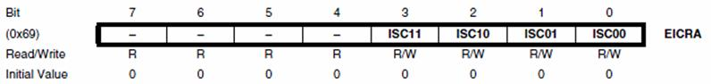
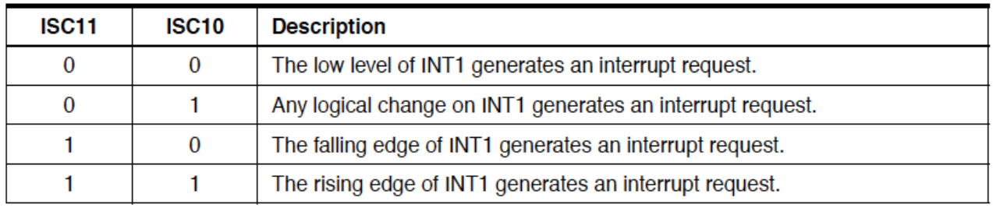
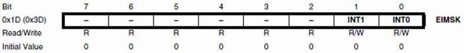

# M1IoT-interruptlab
Intrrupt Lab for M1 IoT and Cyber security

## Before interruption
Check and test arduino sketch in arduino IDE that toggle a led when pusshing a button 
[see the code](arduino_code_int0/led-button.ino)

Now we will add a delay to the above code and adding other work to the microcontroller in the main loop, saying serial sending and delay. Now see what happen when pushing the button
[see the code](arduino_code/leb-buittonèwithdelay.ino)

The microcontroller not respond to the pushbutton signal when it is occupied by the other work


For C code use microship  studio [Sownload from here](https://www.microchip.com/en-us/tools-resources/develop/microchip-studio)
## What is interruption

## Circuit
The used circuit for int0 codes for both arduino skechzq or avr C


The used circuit for pin change interrupt is


# Atemga328p (Arduino Uno) Extenal interrupt description

The ATMega328 microcontroller has two external interrupts: INT0 and INT1. These external interrupts allow the microcontroller to respond to external events or signals asynchronously.

### External Interrupt INT0
1. Associated with PD2 (pin 2) on the ATmega328P.
2. Triggered by any logical change (rising edge, falling edge, or level change) on the INT0 pin, depending on the configuration in the EICRA register.
3. Can be used to trigger an interrupt service routine (ISR) that responds to events such as button presses, sensor readings, or other external signals.
### External Interrupt INT1
1. Associated with PD3 (pin 3) on the ATmega328P.
2. Triggered by any logical change (rising edge, falling edge, or level change) on the INT1 pin, depending on the configuration in the EICRA register.
3. Can be used as a second external interrupt to trigger another ISR for handling additional external events or signals.

To configure INT0 or INT yhous should

STEP 01:
Configure interruption mode in ECRA (External Interrupt Control Register)


The bits ISC00 and ISC01 (bits 0 and 1) are used to configure the mode of INT0.

The bits ISC10 and ISC11 (bits 2 and 3) are used to configure the mode of INT1

The interrupts can be configured in 4 modes




STEP 02:
Enable the interrupt in 
INT0 and INT1 are individually enabled by setting bits INT1 and INT0 in EIMSK (External Interrupt Mask Register).



The bit 0 corresponds to INT0 and the bit 1 corresponds to INT1

The interrput code is wrriten in 
```c
ISR(INT0_vect){
   // interrupt INTO code here
}
```
