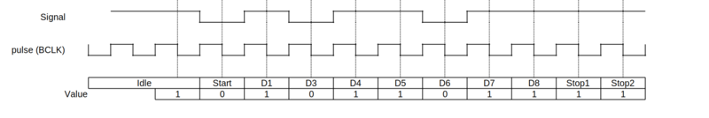
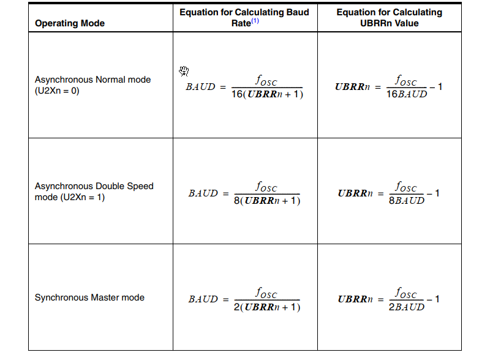
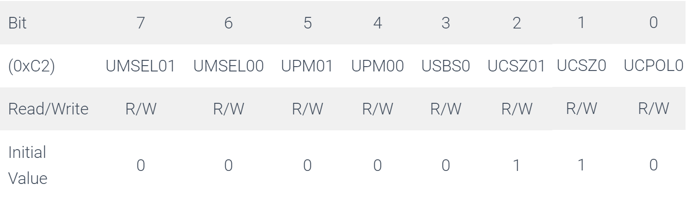
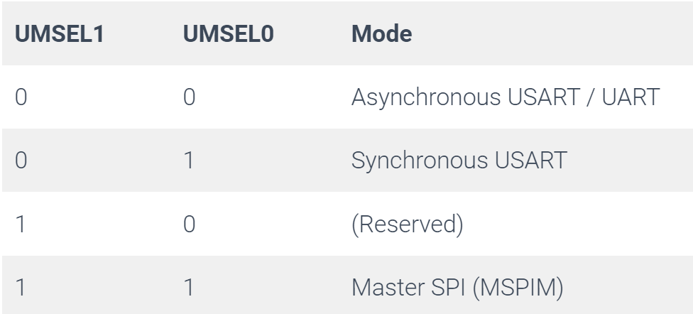
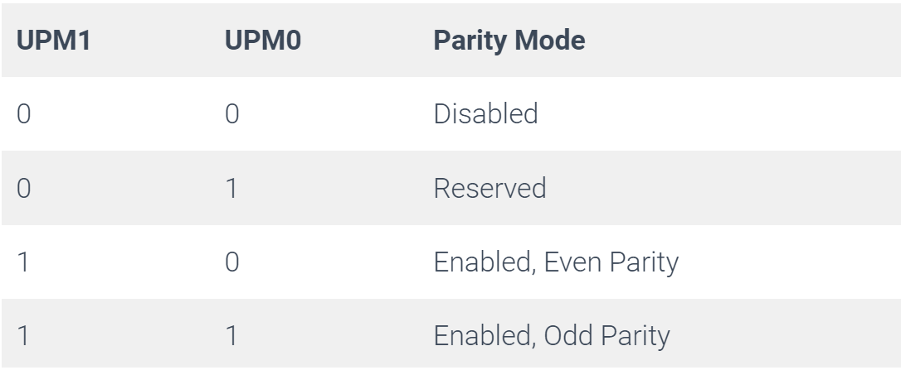
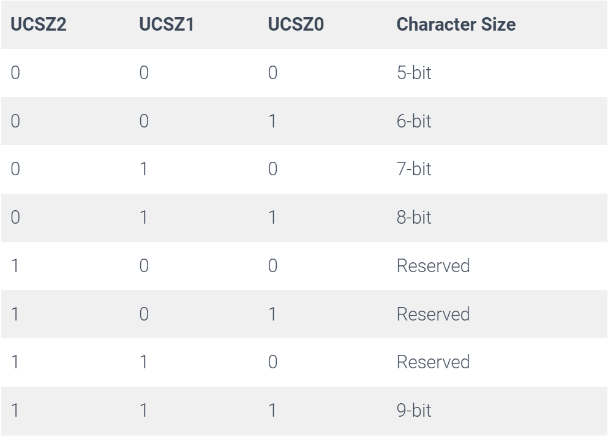
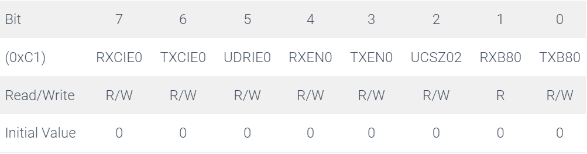
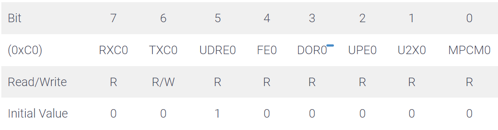
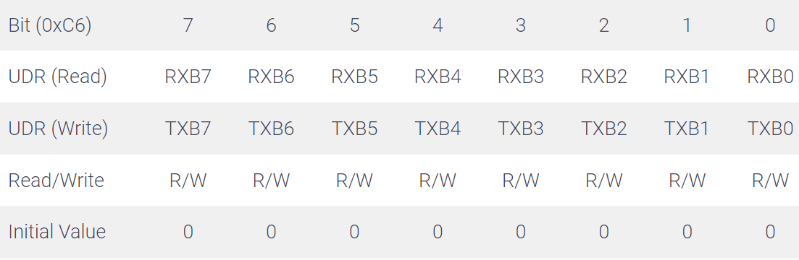

# Serial Communications 

## Basics of Serial Communications

Most microcontrollers include serial communications capability. On the ATmega328P it’s called the Universal Synchronous and Asynchronous serial Receiver and Transmitter (USART).

Embedded systems, microcontrollers, and computers mostly use UART as a form of device-to-device hardware communication protocol. Among the available communication protocols, UART uses only two wires for its transmitting and receiving ends.

A universal asynchronous receiver-transmitter (UART) is a peripheral device for asynchronous serial communication in which the data format and transmission speeds are configurable. It sends data bits one by one, from the least significant to the most significant, framed by start and stop bits so that precise timing is handled by the communication channel.

### Transmitting and receiving serial data

A UART contains those following components:

- a clock generator, usually a multiple of the bit rate to allow sampling in the middle of a bit period
- input and output shift registers, along with the transmit/receive or FIFO buffers
- transmit/receive control
- read/write control logic

For UART to work the following settings need to be the same on both the transmitting and receiving side:

- Voltage level:For the voltage level, 2 UART modules work well when they both have the same voltage level, e.g 3V-3V between the 2 UART modules. To use 2 UART modules at different voltage levels, a level switch circuit needs to be added externally.
- Baud Rate: In telecommunication and electronics, baud is a common unit of measurement of symbol rate, which is one of the components that determine the speed of communication over a data channel, in this case if defines the bit rate
- Parity bit: A parity bit, or check bit, is a bit added to a string of binary code. Parity bits are a simple form of error detecting code. Parity bits are generally applied to the smallest units of a communication protocol, typically 8-bit octets (bytes)
- Data bits size
- Stop bits size
- Flow Control: In data communications, flow control is the process of managing the rate of data transmission between two nodes to prevent a fast sender from overwhelming a slow receiver. 

#### Data framing

A UART frame consists of 5 elements:

- Idle (logic high (1)) //no data transfer is taking place,
- Start bit (logic low (0))
- Data bits
- Parity bit
- Stop (logic high (1))

In the most common settings of 8 data bits, no parity and 1 stop bit (aka 8N1), the protocol efficiency is 80%. 
8-N-1 is a common shorthand notation for a serial port parameter setting or configuration in asynchronous mode, in which there is one start bit, eight (8) data bits, no (N) parity bit, and one (1) stop bit.

Each character is framed as a logic low start bit, data bits, possibly a parity bit and one or more stop bits.


|1|5-9|0-1|1-2|
|-|---|---|---|
|Start bit| Data frame| Parity bits | Stop bits|

**Start bit**

The UART data transmission line is normally held at a high voltage level when it’s not transmitting data. To start the transfer of data, the transmitting UART pulls the transmission line from high to low for one (1) clock cycle. When the receiving UART detects the high to low voltage transition, it begins reading the bits in the data frame at the frequency of the baud rate.


**Data bit**

The UART data transmission line is normally held at a high voltage level when it’s not transmitting data. To start the transfer of data, the transmitting UART pulls the transmission line from high to low for one (1) clock cycle. When the receiving UART detects the high to low voltage transition, it begins reading the bits in the data frame at the frequency of the baud rate.


**Parity bit**
Parity describes the evenness or oddness of a number. The parity bit is a way for the receiving UART to tell if any data has changed during transmission. Bits can be changed by electromagnetic radiation, mismatched baud rates, or long-distance data transfers.

After the receiving UART reads the data frame, it counts the number of bits with a value of 1 and checks if the total is an even or odd number. If the parity bit is a 0 (even parity), the 1 or logic-high bit in the data frame should total to an even number. If the parity bit is a 1 (odd parity), the 1 bit or logic highs in the data frame should total to an odd number.

When the parity bit matches the data, the UART knows that the transmission was free of errors. But if the parity bit is a 0, and the total is odd, or the parity bit is a 1, and the total is even, the UART knows that bits in the data frame have changed.

**Stop bit**
The next one or two bits are always in the mark (logic high, i.e., '1') condition and called the stop bit(s). They signal to the receiver that the character is complete. Since the start bit is logic low (0) and the stop bit is logic high (1) there are always at least two guaranteed signal changes between characters.



Example of a UART frame. In this diagram, one byte is sent, consisting of a start bit, followed by eight data bits (D1-8), and two stop bits, for a 11-bit UART frame. The number of data and cannotformatting bits, the presence or absence of a parity bit, the form of parity (even or odd) and the transmission speed must be pre-agreed by the communicating parties. The "stop bit" is actually a "stop period"; the stop period of the transmitter may be arbitrarily long. It cannot be shorter than a specified amount, usually 1 to 2 bit times. The receiver requires a shorter stop period than the transmitter. At the end of each data frame, the receiver stops briefly to wait for the next start bit. It is this difference which keeps the transmitter and receiver synchronized. BCLK = Base Clock


Embedded systems, microcontrollers, and computers mostly use UART as a form of device-to-device hardware communication protocol. Among the available communication protocols, UART uses only two wires for its transmitting and receiving ends.

### UART Interface

By definition, UART is a hardware communication protocol that uses asynchronous serial communication with configurable speed. Asynchronous means there is no clock signal to synchronize the output bits from the transmitting device going to the receiving end.


The two signals of each UART device are named:

- Transmitter (Tx)
- Receiver (Rx)

The main purpose of a transmitter and receiver line for each device is to transmit and receive serial data intended for serial communication.

The transmitting UART is connected to a controlling data bus that sends data in a parallel form. From this, the data will now be transmitted on the transmission line (wire) serially, bit by bit, to the receiving UART. This, in turn, will convert the serial data into parallel for the receiving device.

For UART and most serial communications, the baud rate needs to be set the same on both the transmitting and receiving device. The baud rate is the rate at which information is transferred to a communication channel. In the serial port context, the set baud rate will serve as the maximum number of bits per second to be transferred.

### Steps of UART Transmission

First: The transmitting UART receives data in parallel from the data bus.


Second: The transmitting UART adds the start bit, parity bit, and the stop bit(s) to the data frame.


Third: The entire packet is sent serially starting from start bit to stop bit from the transmitting UART to the receiving UART. The receiving UART samples the data line at the preconfigured baud rate.


Fourth: The receiving UART discards the start bit, parity bit, and stop bit from the data frame.


Fifth: The receiving UART converts the serial data back into parallel and transfers it to the data bus on the receiving end.


## Serial Communications with the ATmega328P

The ATmega328P contains a Universal Synchronous and Asynchronous serial Receiver and Transmitter
(USART) that can be used do serial communications. The data is transmitted from the ATmega328P on
the TxD pin, and data is received on the RxD pin. The USART0 transmitter (TxD) and receiver (RxD) use the same pins on the chip as I/O ports PD1 and PD0. This means that applications that use the USART0 can not also use these two bits in Port D. It is not necessary to set any bits in the DDRD register in order to use the USART0

**BAUD Rate**

The baud rate is generated from the system clock with the help of Prescaler and clock circuit. The USART Baud Rate Register (UBRR0) controls the programmable down counter / Prescaler to generate a particular clock signal. The down-counter, running at system clock ($f_{clk}$), is loaded with the UBRR0 value each time the counter has counted down to zero and generates a clock pulse.

asynchronous normal mode (Bit U2Xn=0)

$BAUD = \dfrac{f_{clk}}{16 \times (UBRRn + 1)}$ 

$UBRRn = \dfrac{f_{clk}}{16 \times BAUD} - 1$ 

The above formula is used to calculate the right value of UBBR0. For Atmega328p (Arduino UNO) the system clock is running at 16Mhz. If we intend to communicate at a speed of 9600bps:

The value of UBBR0 should be  $UBBR0 = \dfrac{10 `times 10^{6}}{16 \times 9600} - 1 = 103$

The next step is to set the Frame Format using UCSR0C register. The USART accepts all 30 combinations of the following as valid frame formats:

- 1 start bit
- 5, 6, 7, 8, or 9 data bits
- no, even or odd parity bit
- 1 or 2 stop bits

The next step is to enable the Transmitter and Receiver to use UCSR0B register and load the UBR0 register with the data to transmit. In the case of reception, the UBR0 is read by the application.

### UBRR0L and UBRR0H – USART Baud Rate Registers


• Bit 15:12 – Reserved
These bits are reserved for future use. For compatibility with future devices, these bits must be written to zero when UBRRH is written.


• Bit 11:0 – UBRR[11:0]: USART Baud Rate Register
This is a 12-bit register that contains the USART baud rate. The UBRRH contains the four most significant bits, and the UBRRL contains the eight least significant bits of the USART baud rate. Ongoing transmissions by the transmitter and Receiver will be corrupted if the baud rate is changed. Writing UBRRL will trigger an immediate update of the baud rate Prescaler.



### UCSR0C – USART Control and Status Register C



**Bits 7:6 – UMSEL0 1:0 USART Mode Select**

These bits select the mode of operation of the USART



**Bits 5:4 – UPM0 1:0: Parity Mode**

These bits enable and set the type of parity generation and check. If enabled, the Transmitter will automatically generate and send the parity of the transmitted data bits within each frame. The Receiver will generate a parity value for the incoming data and compare it to the UPM setting. If a mismatch is detected, the UPE Flag in UCSRA will be set.



**Bit 3 – USBS0: Stop Bit Select**

This bit selects the number of stop bits to be inserted by the Transmitter. The Receiver ignores this setting.


**Bit 2:1 – UCSZ0 1:0: Character Size**

The UCSZ 1:0 bits combined with the UCSZ 2 bit in UCSRB sets the number of data bits (Character Size) in a frame the Receiver and Transmitter use.



**Bit 0 – UCPOL0: Clock Polarity**

This bit is used for synchronous mode only. Write this bit to zero when asynchronous mode is used. The UCPOL bit sets the relationship between data output change and data input sample, and the synchronous clock (XCK).


### UCSR0B – USART Control and Status Register B



• Bit 7 – RXCIE0: RX Complete Interrupt Enable
Writing this bit to one enables interrupt on the RXC Flag. A USART Receive Complete interrupt will be generated only if the RXCIE bit is written to one, the Global Interrupt Flag in SREG is written to one, and the RXC bit in
UCSRA is set.

• Bit 6 – TXCIE0: TX Complete Interrupt Enable
Writing this bit to one enables interrupt on the TXC Flag. A USART Transmit Complete interrupt will be generated only if the TXCIE bit is written to one, the Global Interrupt Flag in SREG is written to one and the TXC bit in UCSRA is set.

• Bit 5 – UDRIE0: USART Data Register Empty Interrupt Enable
Writing this bit to one enables interrupt on the UDRE Flag. A Data Register Empty interrupt will be generated only if the UDRIE bit is written to one, the Global Interrupt Flag in SREG is written to one and the UDRE bit in UCSRA is set.

• Bit 4 – RXEN0: Receiver Enable
Writing this bit to one enables the USART Receiver. The Receiver will override normal port operation for the RxD pin when enabled. Disabling the Receiver will flush the receive buffer invalidating the FE, DOR, and UPE Flags.

• Bit 3 – TXEN0: Transmitter Enable
Writing this bit to one enables the USART Transmitter. The Transmitter will override normal port operation for the TxD pin when enabled. The disabling of the Transmitter (writing TXEN to zero) will not become effective until ongoing and pending transmissions are completed, i.e., when the Transmit Shift Register and Transmit Buffer Register do not contain data to be transmitted. When disabled, the Transmitter will no longer override the TxD port.

• Bit 2 – UCSZ02: Character Size
The UCSZ2 bits combined with the UCSZ 1:0 bit in UCSRC sets the number of data bits (Character Size) in a frame the Receiver and Transmitter use.

• Bit 1 – RXB80: Receive Data Bit 8
RXB8 is the ninth data bit of the received character when operating with serial frames with nine data bits. Must be read before reading the low bits from UDR.

• Bit 0 – TXB80: Transmit Data Bit 8
TXB8 is the ninth data bit in the character to be transmitted when operating with serial frames with nine data bits. Must be written before writing the low bits to UDR.

### UCSR0A – USART Control and Status Register A



• Bit 7 – RXC0: USART Receive Complete
This flag bit is set when there are unread data in the receive buffer and cleared when the receive buffer is empty. The RXC flag can be used to generate a receive complete interrupt.

• Bit 6 – TXC0: USART Transmit Complete
This flag bit is set when the entire frame in the transmit shift register has been shifted out and there are no new data currently present in the transmit buffer (UDR). The TXC Flag can generate a transmit complete interrupt.

• Bit 5 – UDRE0: USART Data Register Empty
The UDRE Flag indicates if the transmit buffer (UDR) is ready to receive new data. If UDRE is one, the buffer is empty, and therefore ready to be written. The UDRE Flag can generate a Data Register Empty interrupt (see description of the UDRIE bit). UDRE is set after a reset to indicate that the Transmitter is ready.

• Bit 4 – FE0: Frame Error
This bit is set if the next character in the receive buffer had a Frame Error when received. I.e., when the first stop bit of the next character in the receive buffer is zero. This bit is valid until the receive buffer (UDR) is read. The FE bit is zero when the stop bit of received data is one. Always set this bit to zero when writing to UCSRA.

• Bit 3 – DOR0: Data OverRun
This bit is set if a Data OverRun condition is detected. A Data OverRun occurs when the receive buffer is full (two characters), it is a new character waiting in the Receive Shift Register, and a new start bit is detected. This bit is valid until the receive buffer (UDR) is read. Always set this bit to zero when writing to UCSRA.

• Bit 2 – UPE0: USART Parity Error
This bit is set if the next character in the receive buffer had a Parity Error when received and the Parity Checking was enabled at that point (UPM01 = 1). This bit is valid until the receive buffer (UDR) is read. Always set this bit to zero when writing to UCSRA.

• Bit 1 – U2X0: Double the USART Transmission Speed
This bit only has an effect on the asynchronous operation. Write this bit to zero when using synchronous operation. Writing this bit to one will reduce the divisor of the baud rate divider from 16 to 8 effectively doubling the transfer rate for asynchronous communication.

• Bit 0 – MPCM0: Multi-processor Communication Mode
This bit enables the Multi-processor Communication mode. When the MPCMn bit is written to one, all the incoming frames received by the USART Receiver that do not contain address information will be ignored. The Transmitter is unaffected by the MPCM setting.

### UDR0 – USART I/O Data Register



The USART Transmit Data Buffer Register and USART Receive Data Buffer Registers share the same I/O address referred to as USART Data Register or UDRn. The Transmit Data Buffer Register (TXB) will be the destination for data written to the UDRn Register location. Reading the UDR Register location will return the contents of the Receive Data Buffer Register (RXB).

When data is written to the transmit buffer, and the Transmitter is enabled, the Transmitter will load the data into the Transmit Shift Register when the Shift Register is empty. Then the data will be serially transmitted on the TxD pin.

## Polling transmissio

Polling transmission is the simplest method of transmission where the application software keeps monitoring the status of the USART transmitter hardware and loads a byte of data into the USART buffer UDR0 only when the hardware is ready for transmission. This wastes CPU time in constantly monitoring the status of UDRE0 bit of UCSR0A register.

To configure the transmission

```c
#define F_CPU 16000000UL // Defining the CPU Frequency
#define USART_BAUDRATE 9600 // Desired Baud Rate
#define BAUD_PRESCALER (((F_CPU / (USART_BAUDRATE * 16UL))) - 1)

#define ASYNCHRONOUS (0<<UMSEL00) // USART Mode Selection

void USART_Init()
{
	// Set Baud Rate
	UBRR0H = BAUD_PRESCALER >> 8;
	UBRR0L = BAUD_PRESCALER;
	
	// Set Frame Format
	UCSR0C = ASYNCHRONOUS | PARITY_MODE | STOP_BIT | DATA_BIT;
	
	// Enable Receiver and Transmitter
	UCSR0B = (1<<RXEN0) | (1<<TXEN0);
}
```
To send data

```c
void USART_TransmitPolling(uint8_t DataByte)
{
	while (( UCSR0A & (1<<UDRE0)) == 0) {}; // Do nothing until UDR is ready
	UDR0 = DataByte;
}

```

## Polling Reception

Polling reception is the simplest method of reception where the application software keeps monitoring the status of the USART receiver hardware and reads the data from the USART buffer UDR0 only when the hardware has received a byte of data. This wastes CPU time in constantly monitoring the status of RXC0 bit of UCSR0A register.


```c
uint8_t USART_ReceivePolling()
{
	uint8_t DataByte;
	while (( UCSR0A & (1<<RXC0)) == 0) {}; // Do nothing until data have been received
	DataByte = UDR0 ;
	return DataByte;
}
```

## Interrupt Transmission

In polling the CPU waste valuable time monitoring the USART registers. This valuable time could be used in the execution of other instructions. This problem is solved by interrupt based transmission. Below code transmits using interrupts. The code transmits the character ‘a’ endlessly while the D13 LED on Arduino UNO keeps blinking. The CPU keeps performing the LED blinking in an infinite loop and every time the transmission finishes an interrupt is generated to state that the UDR0 buffer is ready to receive new data. The CPU pauses the LED blinking and serves the ISR.

## Interrupt Reception

Interrupt reception behaves exactly the same as polling reception but in the case of interrupt reception. The CPU is busy looping an infinite loop and whenever data is received in USART Buffer an interrupt is thrown and the CPU serves it and toggles the LED accordingly. The CPU doesn’t have to monitor the USART register bits to check the status of the reception.

