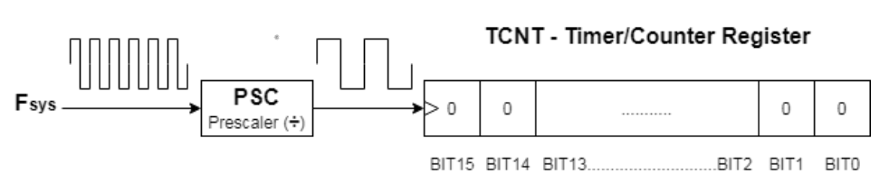
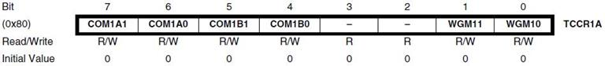
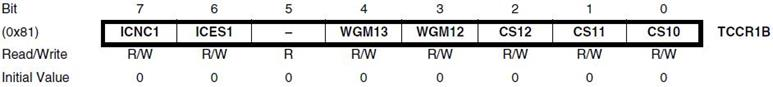
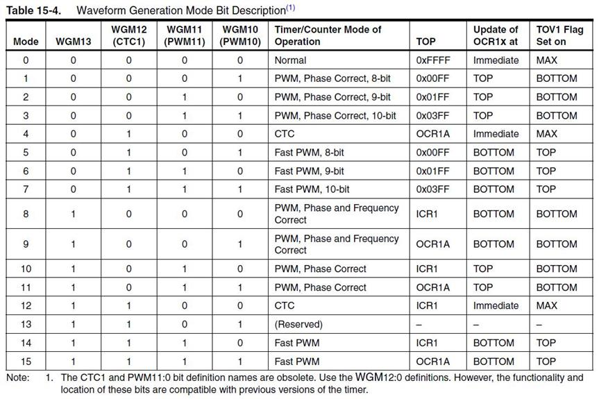
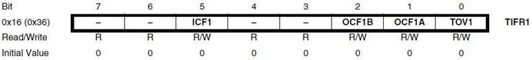
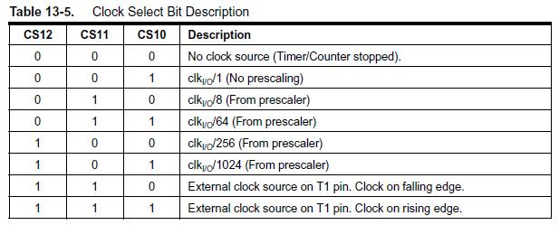
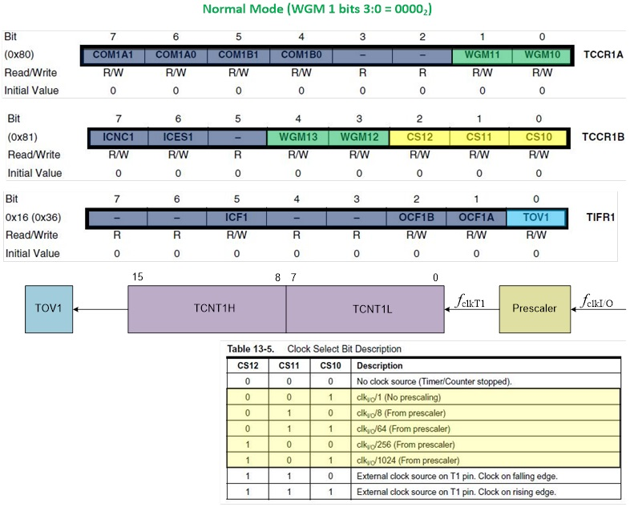
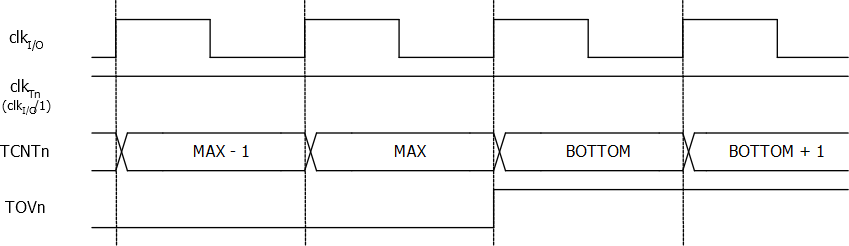
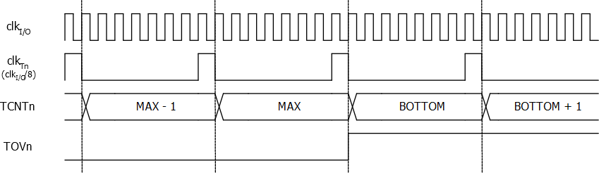
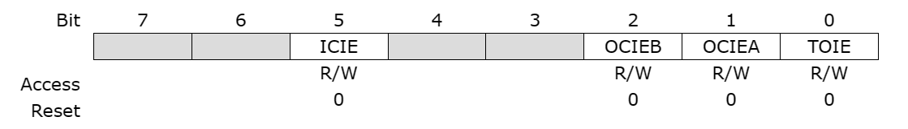

# Timer interrupt

Timer interrupts allow you to perform a task at very specifically timed intervals regardless of what else is going on in your code.

Timer interrupts allow you to momentarily pause the normal sequence of instructions taking place in the loop at precisely timed intervals, where you execute a separate set of instructions. Once these instructions are done the microcontroller picks up again where it was in the loop.

Atemga328p (Arduino UNO) has 3 hardware timers which are:

* Timer/Counter 0: 8-Bit timer (can store a maximum counter value of 255)
* Timer/Counter 1: 16-Bit timer (can store a maximum counter value of 65535)
* Timer/Counter 0: 8-Bit timer (can store a maximum counter value of 255)

## Atemga328p (Arduino Uno) Timer Prescaler

A prescaler in a hardware timer module is a digital circuit that is used to divide the clock signal’s frequency by a configurable number to bring down the timer clock rate so it takes longer to reach the overflow (maximum count number).

This is really useful to control the maximum time interval that can be generated using the timer module, the PWM output frequency, or the range of time that can be measured using the timer module.

Running the timer module at the system frequency is good for resolution but will generate so many timer overflow interrupts that needs extra care in your code. Hence, using a prescaler can be useful to avoid this situation in the first place if needed.

In timer mode, the timer module will have the internal clock of the system as a clock source and it passes through the prescaler as shown below. You can programmatically control the division ratio of the prescaler to control the timer input clock frequency as you need.




## Atemga328p (Arduino Uno) Timer Interrupts

## Atemga328p (Arduino Uno) Timers Control Registers
We can initialize, configure, and control Timers & Timer Interrupts using the associated registers as stated in the datasheet of the microcontroller. The Timer-associated registers are as follows:

* TCCRxA: Timer/Counter Control Register A.
* TCCRxB: Timer/Counter Control Register B.
* TCNTx: Timer/Counter Registers.
* OCRxA: Output Compare A Register.
* OCRxB: Output Compare B Register.
* TMISKx: Timer Interrupts Mask Register, enable/disable timer interrupts.
* TIFRx: Timer interrupts Flag Bits Register, read/clear timer interrupt flag bits.

Where x can be 0, 1, or 2 for timers (Timer/Counter 0, Timer/Counter 1, and Timer/Counter 2) respectively.

In time mode, the timer module will keep counting (0 to 255 or 65535 depending on resolution). At overflow, a timer overflow interrupt is fired and the timer rolls over back to zero and starts counting again.

## Understanding Timer interrupt by example


## Timer interrupt code

### LAB 01: Timer/Counter 1 interrupt overflow

#### 1. Setting Timer/Counter 1 in normal mode

The Timer/Counter 1 mode is set up by TTCR1A and TTCR1B Timer/Counter 1 control register




For normal mode set both TTCR1A and TTCR1B to 0



* In the simple mode the Timer/Counter 1 Register (TCNT1H:TCNT1L) counts up (incrementing), and no counter clear is performed. The counter simply overruns when it passes its maximum 16-bit value 0xFFFF and then restarts 0x0000.
* There are no special cases to consider in the Normal mode, a new counter value can be written anytime.
* In normal operation the Timer/Counter Overflow Flag (TOV1) bit located in the Timer/Counter1 Interrupt Flag Register (T1FR1) will be set in the same timer clock cycle as **the Timer/Counter 1 Register (TCNT1H:TCNT1L) becomes zero.** 
 


### 2. Timer/Counter 1 prescaler

The clock input to Timer/Counter 1 (TCNT1) can be pre-scaled (divided down) by 5 preset values (1, 8, 64, 256, and 1024).

 

Clock Select for Timer/Counter 1 (CS1) bits 2:0 are located in Timer/Counter Control Registers B [yellow].

 

The figures include information on when interrupt flags are set. The first figure below illustrates timing data for basic Timer/Counter operation close to the MAX value in all modes other than Phase Correct PWM mode.



The next figure shows the same timing data, but with the prescaler enabled. with  Prescaler /8 (fclk_I/O/8)




**Example**
For Timer/Counter 1 TCNT1 is 16 bits. 
If we prescale for 256 how to calcule the time TOV1 interrupt occured

Given the Atmegra328P clock is 16 MH = $16.10^6$ Hz = $16.10^6~s^{-1}$

Each cycle takes $1/(16.10^6)~s$ = $6.25.10^{-8}~s$

if we prescale by 256, each Timer/Counter 1 cycle would be $6.25.10^{-8} . 256$ = $1.6 . 10^{-5}~s$

To trigger the TOV1 (Timer/Counter 1 oveflow interrupt) it takes from 0x0000 to 0xffff incerements, each increment done in onr timer cycle with tales $2^{16}$ cycle, ie. 65536 cycle

So the TOV1 is trigrerreb after $1,6 . 10^{-5} . 65536 = 1.048576~s$

Equation for calculating TOV1 time

$T_{MAX}=\frac{2^n N}{f_{clk}}$
- $T_{MAX}$ maximum time
- N  prescaler (divider)
- n size in bit of the Timer/Counter register and $2^n$ respresent tne number of Timer/Counter to reach the overflow

For the previuos example,
$T_{MAX}=\frac{2^{16} 256}{16.10^6}=1.048576~s$

### 3. Timer/Counter 1 Interrupt Enabling

The TIMSK1 register iTimer/Counter 1 Interrupt Mask Register


Bit 0 – TOIE: Overflow Interrupt Enable
When this bit is written to '1', and the I-flag in the Status Register is set (interrupts globally enabled), the Timer/Counter 1 Overflow interrupt is enabled. The corresponding Interrupt Vector is executed when the TOV Flag, located in TIFR1, is set.

Put all together, 

the arduino uno code

```c
ISR(TIMER1_OVF_vect)
{
  // Handle The 100ms Timer Interrupt
  //...
}

 void setup()
{
  TCCR1A = 0;           // Init Timer/Counter 1
  TCCR1B = 0;           // Init Timer/Counter 1
  TCCR1B |= B00000101;  // Prescalar = 256
  TIMSK1 |= B00000001;  // Enable Timer Overflow Interrupt
}

void loop(){

}
```

The C code is almost the same

```c
#ifndef F_CPU
#define F_CPU 16000000
#endif

#include <avr/io.h>
#include<util/delay.h>
#include <avr/interrupt.h>
#include <stdbool.h>
#include <stdio.h>


// Handle interrupt TIMER1_OVF_vect
ISR (TIMER1_OVF_vect) {
	// Toggle LED
	PORTB = PORTB ^ (1<<PINB5); //XOR to toggle the bit 5
}

int main(void)
{
  DDRB = DDRB | (1<<PINB5);  //0x20   PINB5 output
	
  TCCR1A = 0;           // Init Timer1A
  TCCR1B = 0;           // Init  Timer1B
  TCCR1B |= 0b00000100;  // Prescaler = 256
  TIMSK1 |= 0b0000001;  // Enable Timer Overflow Interrupt

  sei();
	
  while (1);
}
```
#### Timer/Counter 1 preloading

Let’s say you’d like to generate a periodic timer interrupt every 500ms, there we use **Timer/Counter 1 preloading**.

By default the counter register TCNT1 count 65536 timer tick (cycle)

In the above equation, ($T_{MAX}=\frac{2^n N}{f_{clk}}$) $2^n$ represents the number of ticks.

We can write $T_{out}=\frac{nticks \times N}{f_{clk}}$

SBy setting $T_{out}=500~ms=0.5~s$ and replacing other parameters we find:

$0.5=\frac{nticks \times 256}{16 10^{6}}$

SO, $nticks=\frac{0.5 \times 16~10^{6} }{256}=56250$ ticks

Tp trigger a time of 900 ms before TOV1 interrupt, we should preload TCNT1 = 65536 - 31250 = 34286

The code would be
```c
ISR(TIMER1_OVF_vect)
{
  TCNT1 = 34286; // Timer Preloading
  // Handle The 100ms Timer Interrupt
  //...
}

 void setup()
{
  TCCR1A = 0;           // Init Timer/Counter 1
  TCCR1B = 0;           // Init Timer/Counter 1
  TCCR1B |= B00000100;  // Prescalar = 256
  TCNT1 = 34286;        // Timer Preloading
  TIMSK1 |= B00000001;  // Enable Timer Overflow Interrupt
}
```

